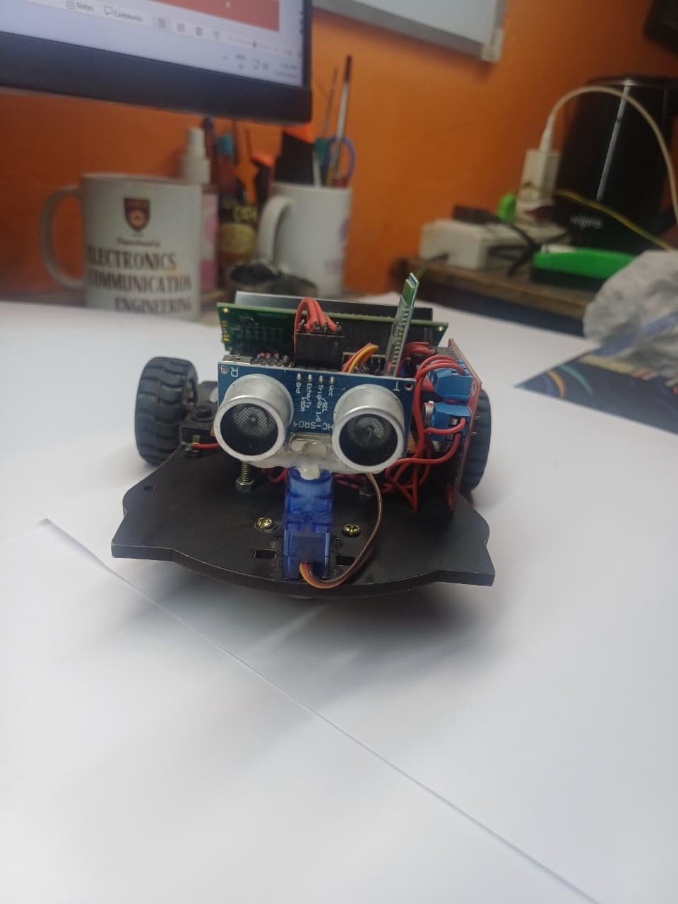
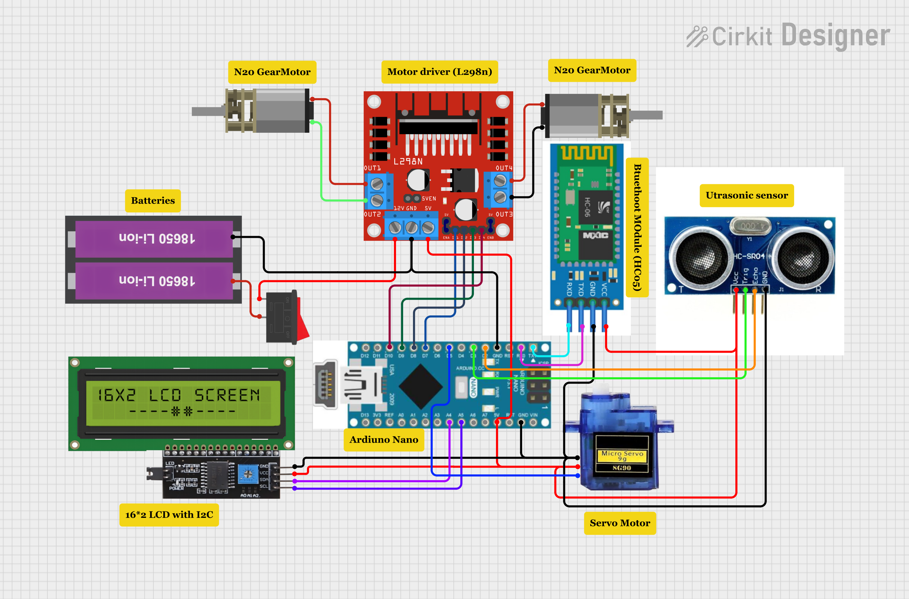
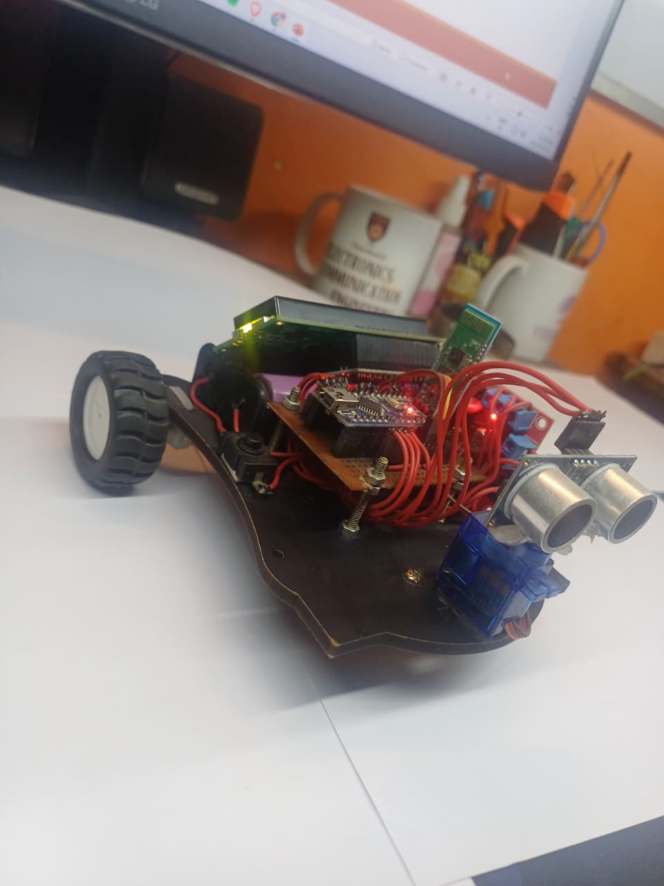
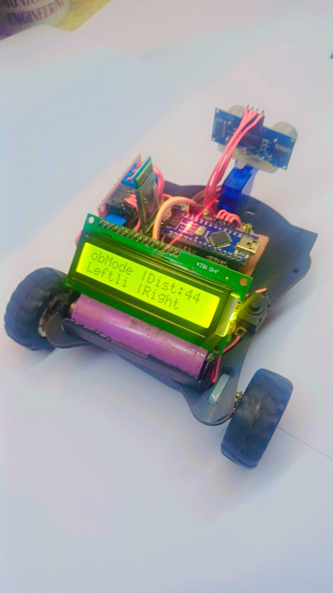
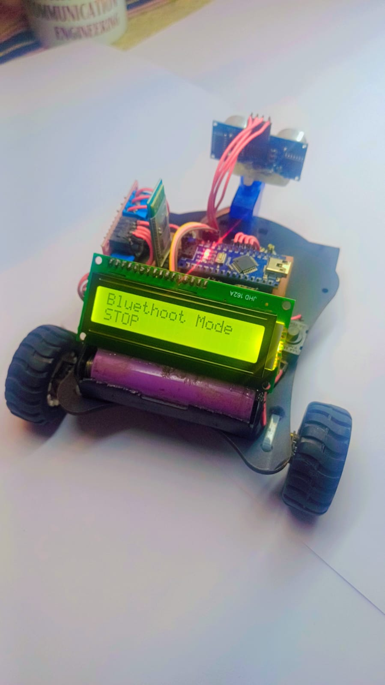
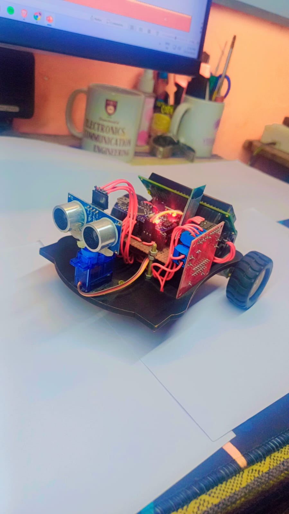
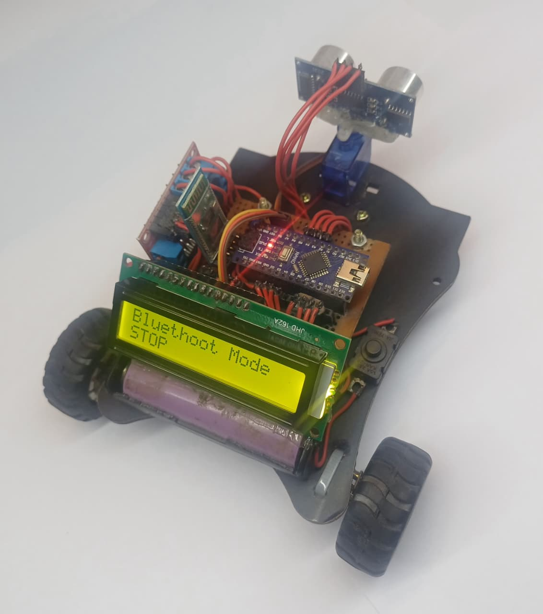

# DriveX 1.0 🚗🤖

**DriveX 1.0** is a compact Arduino-based dual-mode robotic car developed as an ECE mini-project. It combines **Bluetooth manual control** with **ultrasonic obstacle avoidance** in a single mobile platform.



## Overview

DriveX operates in two modes:

- **Bluetooth Mode** — manual smartphone control through an HC-05 Bluetooth module.
- **Obstacle Avoidance Mode** — an HC-SR04 ultrasonic sensor mounted on an SG90 servo scans the surroundings and the robot chooses a turn direction.

A 16×2 I2C LCD provides feedback about the mode, movement and measured distance.

> **Status:** DriveX 1.0 is a completed educational prototype. Camera vision, AI detection, GPS, Wi-Fi and cloud features are future-scope concepts, not implemented features of this version.

## Features

- Arduino Nano embedded control
- Bluetooth wireless manual driving
- Dual operating modes
- L298N differential motor control
- Ultrasonic obstacle detection
- Servo-based scanning
- I2C LCD status display
- Battery-powered mobile platform

## Hardware

| Component | Purpose |
|---|---|
| Arduino Nano | Main controller |
| HC-05 | Bluetooth communication |
| L298N | Motor driver |
| N20 gear motors | Robot drive |
| HC-SR04 | Obstacle detection |
| SG90 | Ultrasonic sensor scanning |
| 16×2 I2C LCD | User feedback |
| Battery pack | Power |
| Chassis & wheels | Mechanical structure |

## Working

```text
Smartphone -> HC-05 -> Arduino Nano -> L298N -> Motors
                              |
                              +-> LCD
                              |
                              +-> HC-SR04 + SG90 -> obstacle scanning
```

### Bluetooth commands

| Command | Function |
|---|---|
| `F` | Forward |
| `B` | Backward |
| `L` | Left |
| `R` | Right |
| `S` | Stop |
| `X` | Switch to obstacle mode |
| `x` | Return to Bluetooth mode |

## Circuit Diagram



## Project Photos

| Front | Build | Obstacle Mode |
|---|---|---|
|  |  |  |

| Bluetooth Mode | Side | Top |
|---|---|---|
|  |  |  |

## Demo

Two demonstration videos are included in [`media/demo/`](media/demo/).

## Firmware Setup

1. Install Arduino IDE.
2. Select **Arduino Nano**.
3. Install: `Servo`, `NewPing`, `SoftwareSerial`, `Wire`, and `LiquidCrystal_I2C`.
4. Open `firmware/DriveX/DriveX.ino`.
5. Verify the wiring using [`hardware/pinout.md`](hardware/pinout.md).
6. Upload the firmware.

## Documentation

- [Pinout](hardware/pinout.md)
- [Components](hardware/components.md)
- [Working principle](documentation/working-principle.md)
- [Testing & results](documentation/testing.md)
- [Project scope](documentation/project-scope.md)
- [Project report](documentation/DriveX-Project-Report.docx)
- [Project presentation](documentation/DriveX-Presentation.pptx)

## Known Limitations

- Motor speed is commanded at maximum PWM in the original firmware.
- Obstacle avoidance uses a simple threshold and timed turning rather than closed-loop navigation.
- There are no wheel encoders.
- Bluetooth is assigned to D0/D1 while `Serial` is also used, which can cause UART conflicts.
- Ultrasonic measurements are affected by environment and target surface.

## Future Scope

- Wheel encoders and closed-loop control
- Improved obstacle-navigation logic
- Camera and computer vision
- Object/person detection
- Wi-Fi/GPS telemetry
- Voice control
- Cloud data logging

## Project Team

Based on the submitted project report:

- **Ashwani Patel**
- **Bhumika Chaudhary**
- **Anuj Bansal**
- **Anil Soni**

## License

MIT License — see [`LICENSE`](LICENSE).
